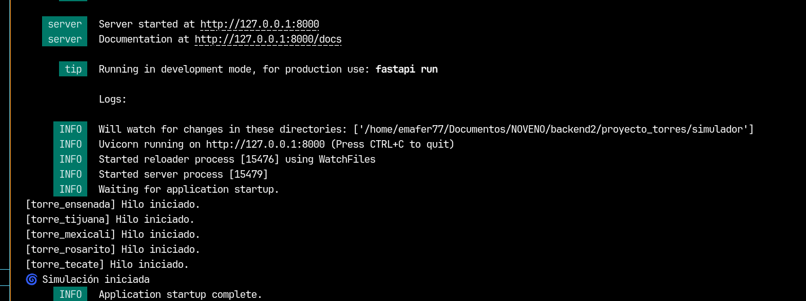
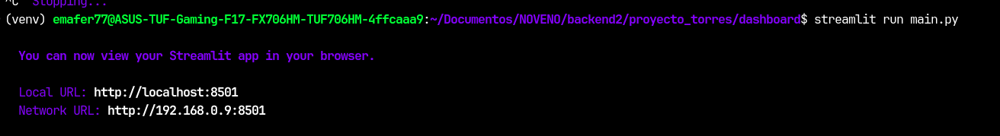
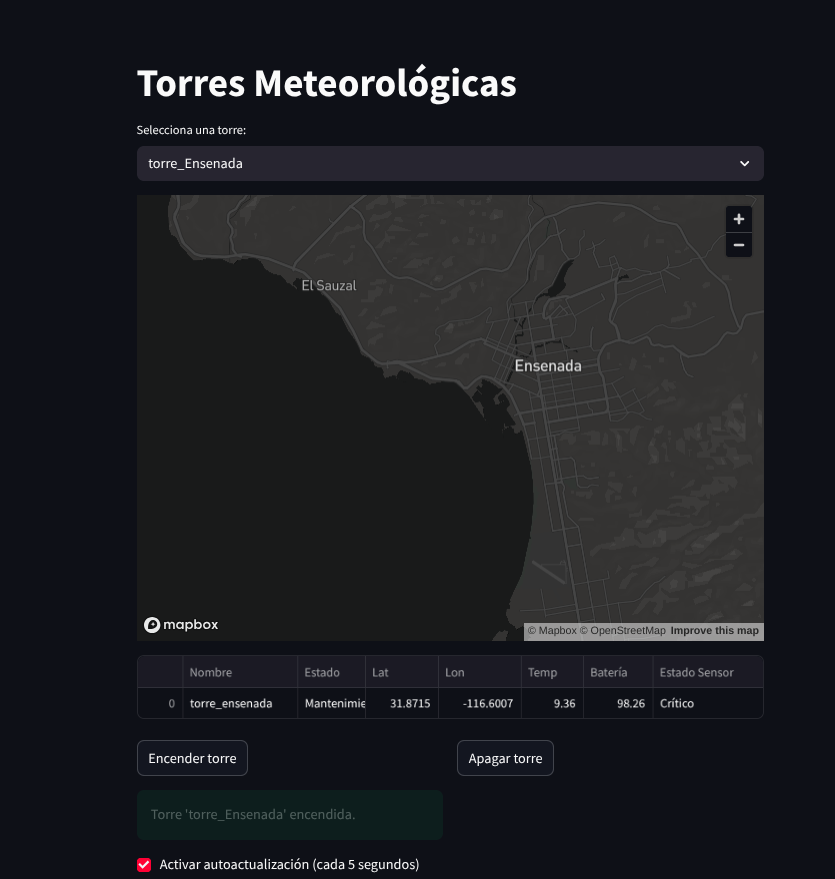

**Autor**:  Fernando Emanuel Ramirez Ahumada

***
# Proyecto de Simulación de Torres Meteorológicas

Este proyecto simula torres meteorológicas que generan datos climáticos en tiempo real. Cada torre funciona en su propio hilo, puede encenderse o apagarse de forma individual, y guarda los datos en una base de datos local SQLite y en Supabase.

## Funcionalidades

- Simulación de múltiples torres meteorológicas independientes.
- Generación periódica de datos: temperatura, humedad, presión, velocidad del viento, etc.
- Base de datos SQLite local para respaldo y pruebas locales.
- Integración con Supabase como backend en la nube para almacenamiento remoto.
- API local para visualizar datos o integrarlos con dashboards como Streamlit.
- Control individual de encendido y apagado de cada torre.

## Requisitos

- Python 3.9 o superior
- pip
- Cuenta y proyecto en [Supabase](https://supabase.com/)
- Claves API de Supabase

## Instalación

### 1. Clona el repositorio

```bash
git clone https://github.com/emafer77/proyecto_torres_metereologicas.git
cd proyecto_torres_meteorologicas
```

### 2. Crea y activa un entorno virtual (opcional pero recomendado)

```bash
python -m venv venv
source venv/bin/activate  # En Windows usa: venv\Scripts\activate
```

### 3. Instala las dependencias

```bash
pip install -r requirements.txt
```

### 4. Configura las variables de entorno

Crea un archivo `.env` en la raíz del proyecto y añade tus claves de Supabase:

```env
SUPABASE_URL=https://xxxx.supabase.co
SUPABASE_KEY=tu_clave_secreta
```

### 5. Inicializa la base de datos local SQLite

crea las tablas en sqlite con el archivo `tablas_sqlite.sql` si no se crear autimaticamente

### 6. Inicializa la base de datos remota en supabase

crea las tablas en supabase con el archivo `tablas_subase.sql`

## Uso

Para correr el simulador de torres:

```bash
cd simulador
fastapi dev api.py
```

Esto iniciará las torres meteorológicas y comenzarán a emitir datos cada cierto intervalo.

Puedes encender o apagar torres desde la consola o una interfaz adicional (por ejemplo, una API local o dashboard).


## Dashboard

Para ver el dashboard en tiempo real se debe correr desde una nueva terminal

```bash
cd dashboard
streamlit run main.py
```



